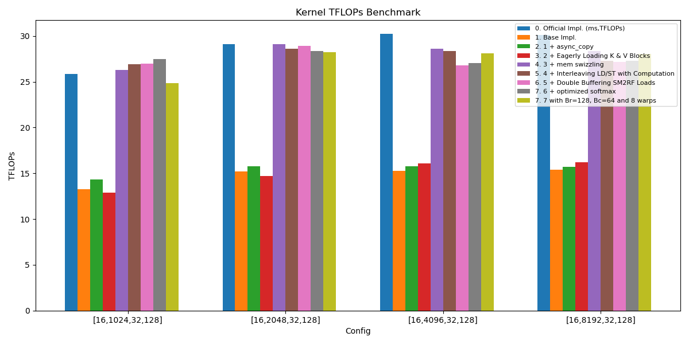

# ampere_flash_attention_from_scratch
This is an implementation of flash attention from scratch on Nvidia's Ampere architecture ( RTX 3080 for verification).

``` shell
# step1: build kernel
python setup.py build_ext --inplace

# step2: test demo
python demo.py
```

## Performance Test
Conducted performance testing of the kernel implementation versus the official implementation ([script for official implementation testing](https://github.com/Roger-Fpeng/flash-attention/commit/93c173b13d9392551ca8ac7e378a77ba4f4dbd08#diff-ea9860ac378d44e5f307b5be14b559e326da5a5894124ebfde64faf916238210)). All experiments were run on an NVIDIA RTX 3080 GPU with:
- PyTorch version: 2.7.0+cu128
- Capability: (8, 6)


The header denotes [batch_size, seq_len, num_heads, head_dim].
Row 0 reports the official implementation TFLOPs, while rows 1–5 show performance as a percentage relative to the official implementation. 
Incidentally, the theoretical FP16 compute throughput of the RTX 3080 is [29.77 TFLOPs](https://www.waredb.com/processor/nvidia-geforce-rtx-3080). For simplicity, we count the total FLOPs as:

2
×
batch_size
×
num_heads
×
seq_len
2
×
head_dim
.
2×batch_size×num_heads×seq_len
2
×head_dim.

Under this approximation, the measured TFLOPs can be slightly greater than the theoretical value.

| Kernel | [16,1024,32,128] | [16,2048,32,128] | [16,4096,32,128] | [16,8192,32,128] |
|---|---|---|---|---|
| 0. Official Impl. (ms,TFLOPs) | [5.32, 25.84], 100.00% | [18.87, 29.14], 100.00% | [72.79, 30.21], 100.00% | [292.02, 30.12], 100.00% |
| 1. Base Impl. | [10.35, 13.28], 51.39% | [36.15, 15.21], 52.20% | [144.21, 15.25], 50.48% | [570.67, 15.41], 51.16% |
| 2. 1 + async_copy | [9.61, 14.30], 55.34% | [34.94, 15.74], 54.02% | [139.67, 15.74], 52.10% | [560.26, 15.70], 52.12% |
| 3. 2 + Eagerly Loading K & V Blocks | [10.69, 12.86], 49.77% | [37.42, 14.69], 50.41% | [136.99, 16.05], 53.13% | [543.61, 16.18], 53.72% |
| 4. 3 + mem swizzling | [5.22, 26.32], 101.86% | [18.91, 29.08], 99.79% | [76.94, 28.58], 94.60% | [310.35, 28.34], 94.09% |
| 5. 4 + Interleaving LD/ST with Computation | [5.11, 26.91], 104.14% | [19.22, 28.60], 98.15% | [77.53, 28.36], 93.88% | [322.10, 27.31], 90.67% |
| 6. 5 + Double Buffering SM2RF Loads | [5.10, 26.96], 104.33% | [19.02, 28.90], 99.18% | [82.06, 26.80], 88.71% | [323.92, 27.15], 90.14% |
| 7. 6 + optimized softmax | [5.00, 27.50], 106.42% | [19.39, 28.36], 97.32% | [81.35, 27.03], 89.47% | [322.10, 27.31], 90.67% |
| 7. 7 with Br=128, Bc=64 and 8 warps | [5.53, 24.83], 96.09% | [19.45, 28.26], 96.98% | [78.22, 28.11], 93.05% | [313.72, 28.04], 93.09% |

## Result with histogram
<p align="center">
  
</p>


# Implementation Explanation (Blog Post)
1. [Flash attention mechanism](https://zhuanlan.zhihu.com/p/2011287950818840919)
2. [GEMM and Tiling](https://zhuanlan.zhihu.com/p/2011926671276651005)
3. Data movement (TODO)
4. Online Softmax (TODO)